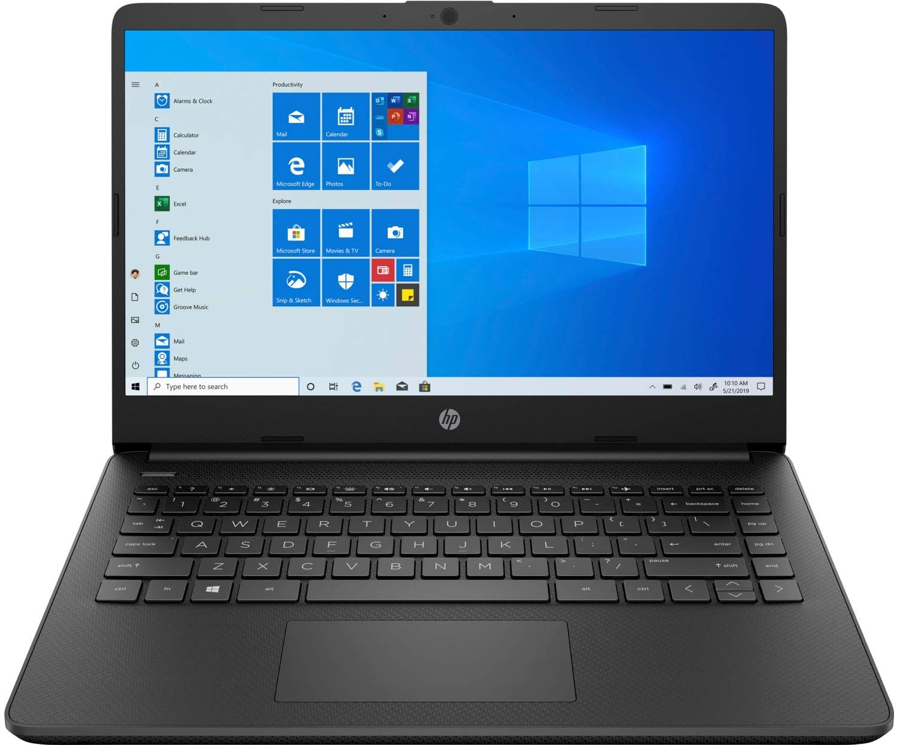

## WELCOME 

<html>
<head>
<meta name="viewport" content="width=device-width, initial-scale=1.0">
</head>
<body>

<h2>Setting the Viewport</h2>

This example does not really do anything, other than showing you how to add the viewport meta element.

</body>
</html>

**AMAZON AND FLPKART DEALS**

<html>
   <body>
      <h1> >>> HP i3 11th gen laptop</h1>
        
   </body>
</html>

**Amazon**

[Link](https://www.amazon.in/gp/product/B08XY3843B/ref=as_li_tl?ie=UTF8&tag=rafstore-21&camp=3638&creative=24630&linkCode=as2&creativeASIN=B08XY3843B&linkId=5ba612186936affa8f4a4dfad9857825)

**In flipkart**

[Link](http://fkrt.it/N6QJy8uuuN)

<html>
   <body>
      <h1> >>>SleepX Dual Medium Soft Foam Mattress </h1>
    </body>
 </html>
   
   
   [Link](http://fkrt.it/tn2yhhNNNN)
   
**Amazon**

[Link](https://amzn.to/3eXN62e)

**Amazon**

<html>
   <body>
      <h1> >>>Samsung 125 cm (50 inches) Crystal 4K Series Ultra HD Smart LED TV</h1>
    </body>
 </html>
 
 [Link](https://amzn.to/33e14Ht)
 
**Flipkart**

 <html>
   <body>
      <h1> >>>LG All-in-One 126 cm (50 inch) Ultra HD (4K) LED Smart TV</h1>
    </body>
 </html>
 
 
[Link](http://fkrt.it/ienR6vNNNN)

   
### Support or Contact

Having trouble with Pages? Check out our [documentation](https://docs.github.com/categories/github-pages-basics/) or [contact support](https://support.github.com/contact) and we’ll help you sort it out.
